# eda_4team

### 팀원
김우중
임수연
조민훈

### 서론
주택보유율이 낮은 이 시대에 내집 마련에 도움이 되기 위해서 주택 특성을 이용하여 주택가격 예측하고 합리적인 주택 구매를 위하여 시스템을 설계
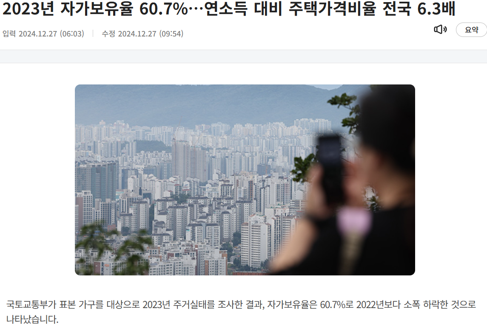
###### 출처 : https://news.kbs.co.kr/news/pc/view/view.do?ncd=8139571

### EDA 진행 목차
1. 데이터 로드
- 데이터는 Kaggle에서 house price prediction으로 검색하여 가장 최근에 업데이트된 데이터를 선정하였다.

- 데이터 확인
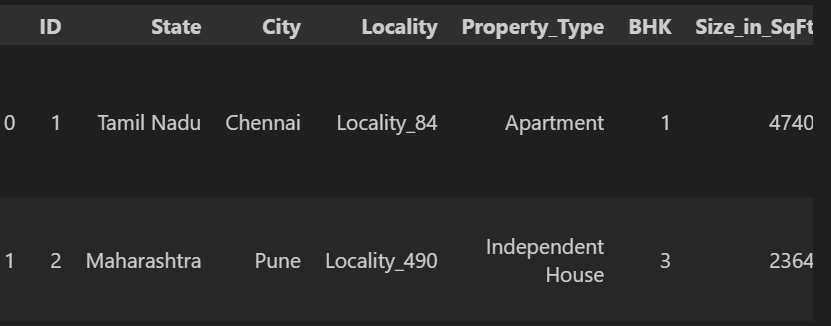

2. 데이터 구조 및 기초 통계 확인
- 12개의 문자형 변수와 11개의 숫자형 변수로 구성되어 있으며 결측치가 존재하지 않는다.
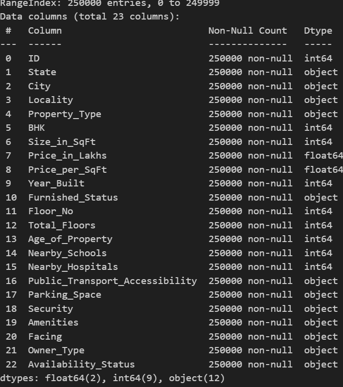
- 기본 통계 정보를 확인하였을때 0인 값이 존재
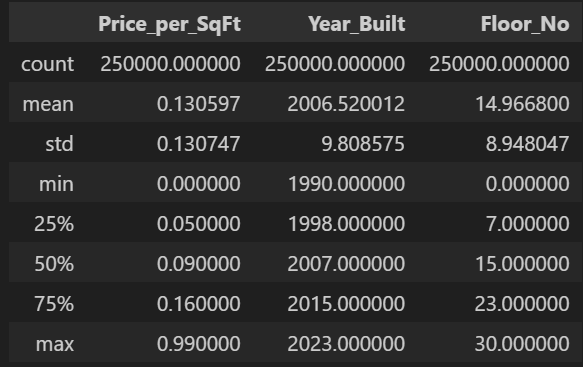
- Price_per_SqFt는 제곱피트당 가격으로 0이 나와서는 안되는 값이라 따로 계산해본 결과 소수점 둘째 자리에서 잘리면 0으로 나오는 것을 확인하였다.
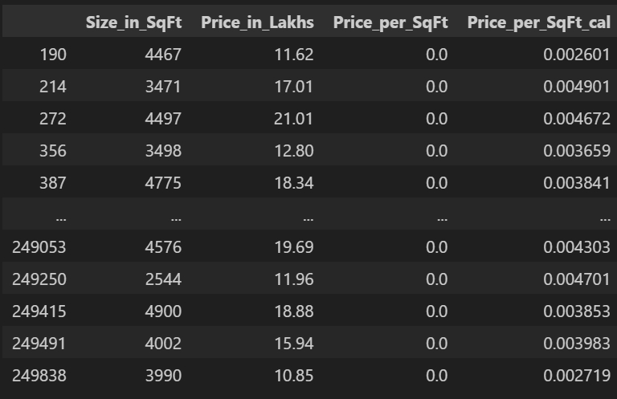
- Locality 변수는 지역번호로 Locality_1 ~ Locality_500까지의 변수들이 들어있으며, 여기에 라벨 인코더를 사용하면 모델에 숫자형 처럼 적용될 것이며,  원-핫 인코더를 사용하면 데이터의 변수가 500개 이상으로 나와 분석이 어려워진다.

3. 결측치 및 이상치 탐색
- 데이터 탐색 과정에서 결측치(NaN)가 발견되지 않아 결측치 처리는 생략하였다.
- 이상치(Outlier)를 탐색하기 위하여 모든 변수에 대해 BoxPlot을 그려 보았으며 이상치를 찾을 수 없었다.(평방피트)?
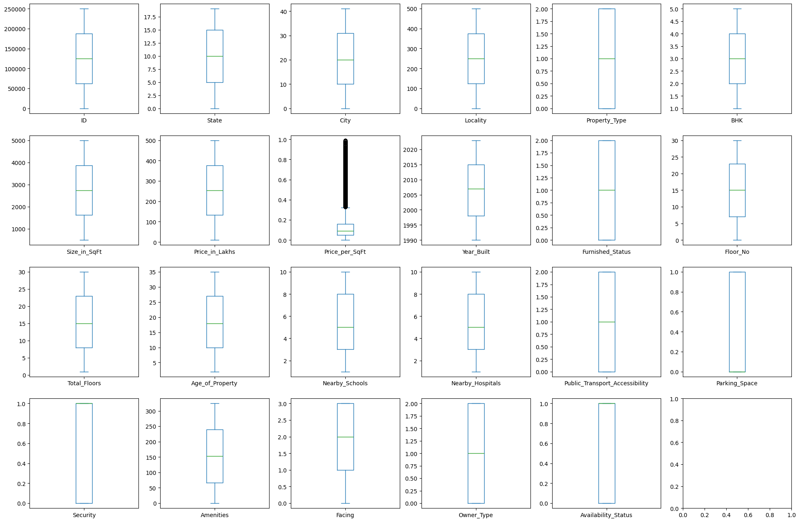

4. 데이터 시각화를 통한 탐색
- HeatMap을 통해 변수별 상관관계를 확인해 보았다.
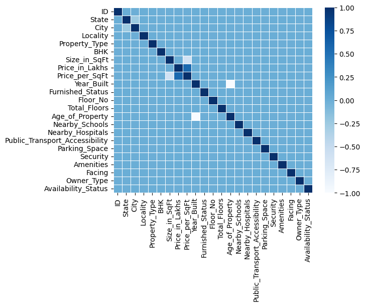
- Regplot을 통해 Target변수와 선형관계를 확인해 보았다.
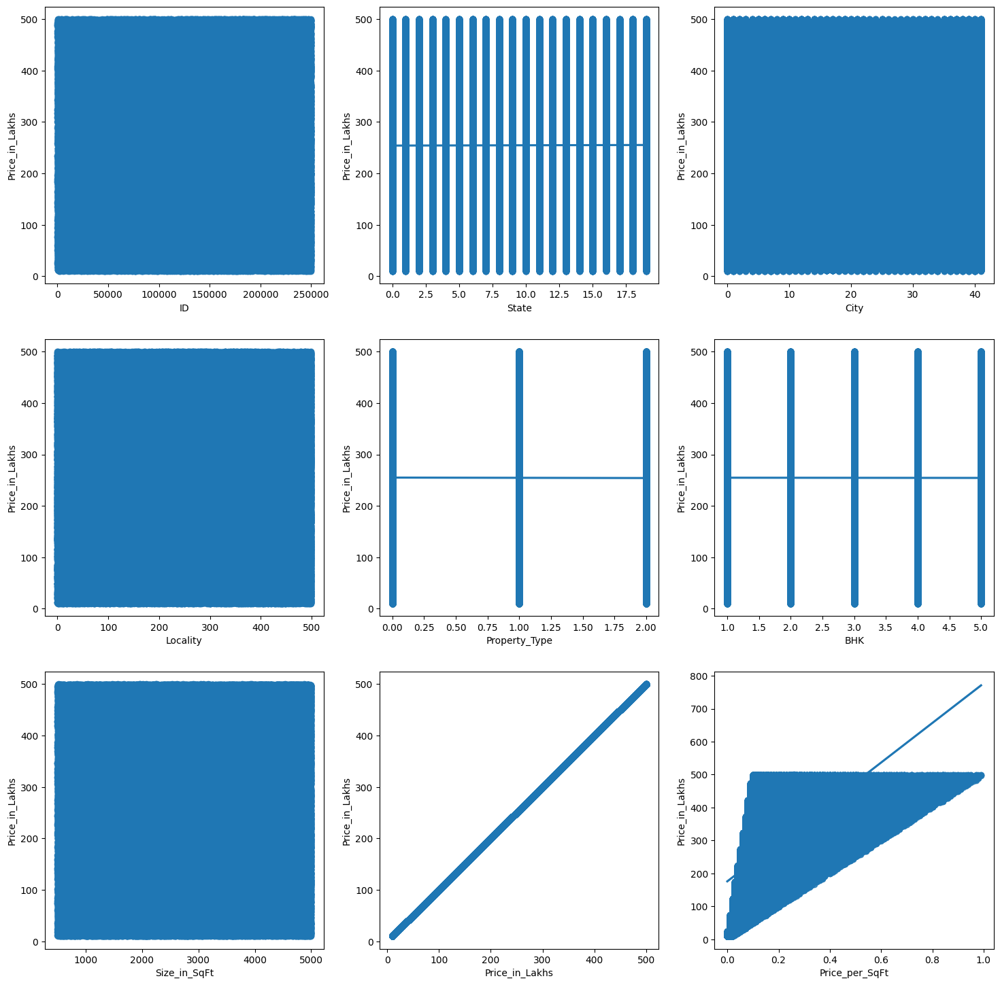
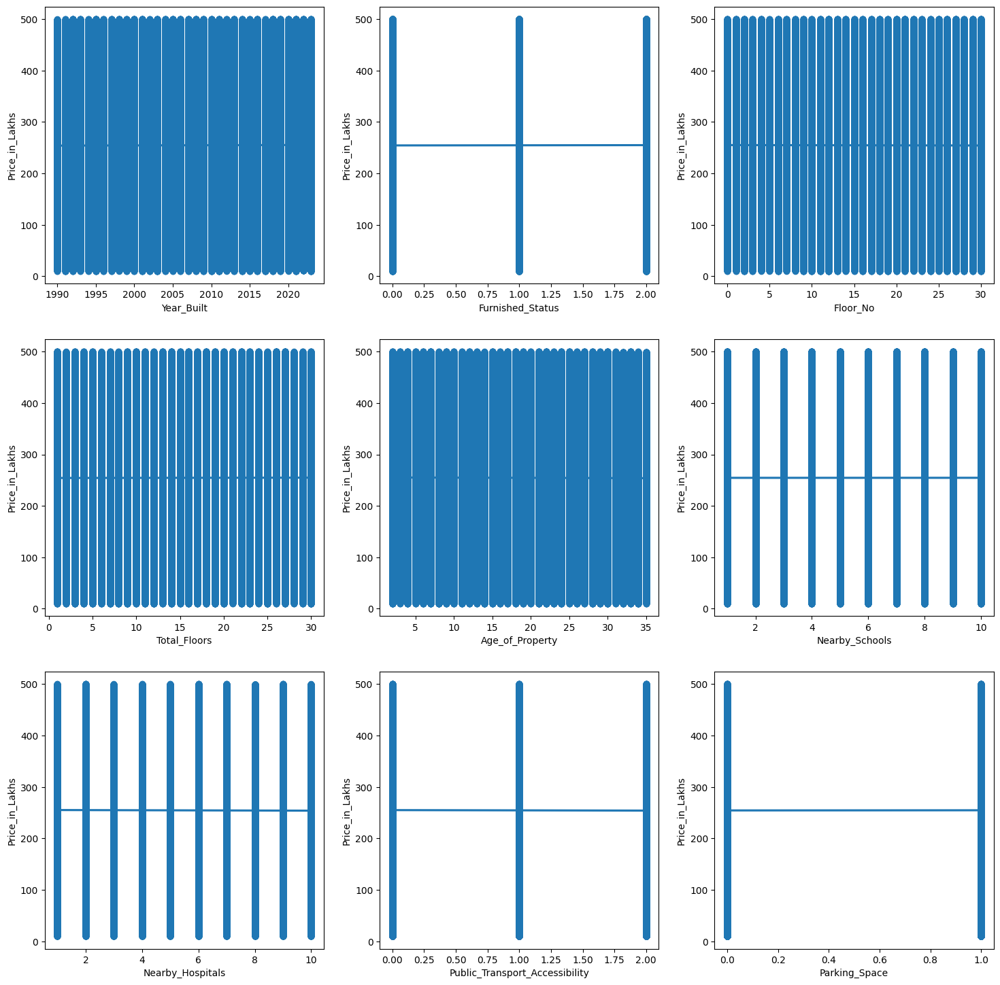
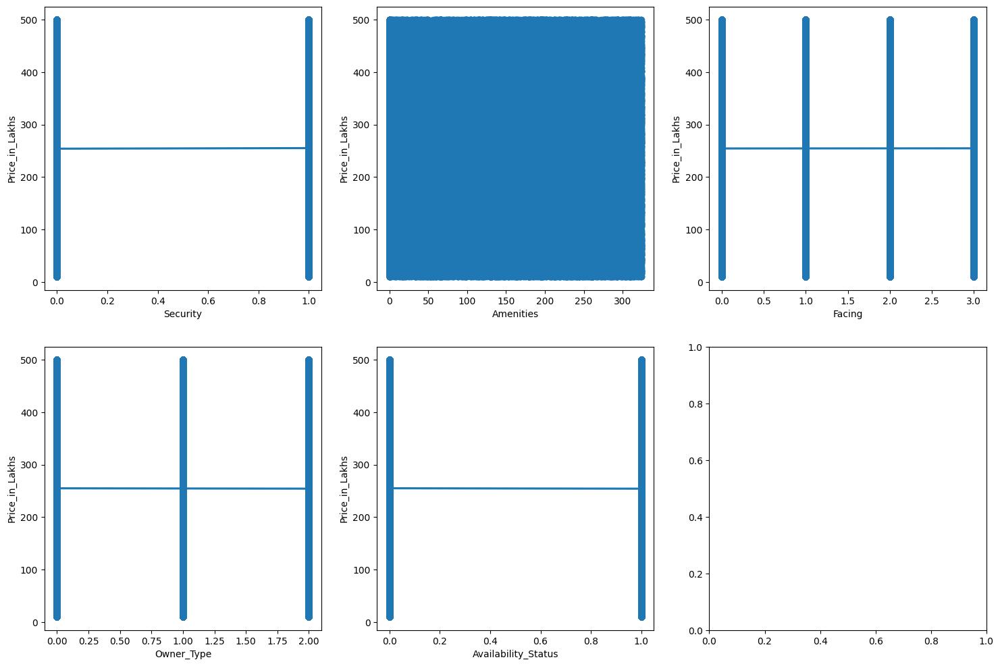
- 연도별 건축된 건물의 유형을 확인해 보았다.
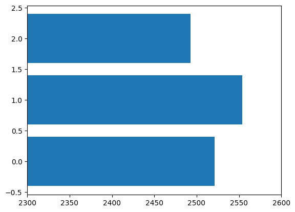
- 층과 관련된 변수인 Floor_No, Total_Floors와 집값과의 관계를 확인해 보았다.

5. 데이터 정제 및 전처리
- 필요 없는 변수나 중복 데이터를 제거한다.
ID 제거
locality, Year_Built 제거
Floor_No, Total_Floors 제거 고려
- 범주형 데이터를 처리하거나, 스케일링 및 정규화를 통해 모델에 적합한 형태로 데이터를 변환한다.
- 라벨링
- 스케일링

이 데이터 분석 결과 이 데이터는 굉장히 잘 정제된 데이터로 각 변수간의 특정한 관계나 경향성을 파악할 수 없었다. 따라서 이 데이터를 분석한다면 회귀 분석 등의 통계기법이 아닌 머신러닝 기법을 사용하여 데이터를 분석하는 것이 좋을 것으로 보인다.
