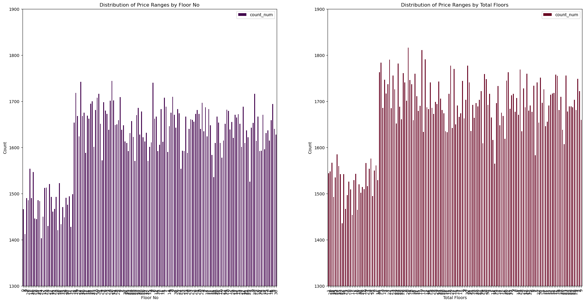

# eda_4team

### 팀원

| 김우중 | 임수연 | 조민훈 |
|--|--|--|
|<a href="https://github.com/kwj9942">@kwj9942</a>|<a href="https://github.com/ohback">@ohback</a>|<a href="https://github.com/alche22">@alche22</a>|

### 서론
주택보유율이 낮은 이 시대에 내집 마련에 도움이 되기 위해서 주택 특성을 이용하여 주택가격 예측하고 합리적인 주택 구매를 위하여 시스템을 설계

###### 출처 : https://news.kbs.co.kr/news/pc/view/view.do?ncd=8139571

### EDA 진행 목차
1. 데이터 로드
- 데이터는 Kaggle에서 house price prediction으로 검색하여 가장 최근에 업데이트된 데이터를 선정하였다.

- 데이터 확인

2. 데이터 구조 및 기초 통계 확인
- 12개의 문자형 변수와 11개의 숫자형 변수로 구성되어 있으며 결측치가 존재하지 않는다.

- 기본 통계 정보를 확인하였을때 0인 값이 존재

- Price_per_SqFt는 제곱피트당 가격으로 0이 나와서는 안되는 값이라 따로 계산해본 결과 소수점 둘째 자리에서 잘리면 0으로 나오는 것을 확인하였다.

- Locality 변수는 지역번호로 Locality_1 ~ Locality_500까지의 변수들이 들어있으며, 여기에 라벨 인코더를 사용하면 모델에 숫자형 처럼 적용될 것이며,  원-핫 인코더를 사용하면 데이터의 변수가 500개 이상으로 나와 분석이 어려워진다.

3. 결측치 및 이상치 탐색
- 데이터 탐색 과정에서 결측치(NaN)가 발견되지 않아 결측치 처리는 생략하였다.
- 이상치(Outlier)를 탐색하기 위하여 모든 변수에 대해 BoxPlot을 그려 보았으며 이상치를 찾을 수 없었다.(평방피트)?

4. 데이터 시각화를 통한 탐색
- HeatMap을 통해 변수별 상관관계를 확인해 보았다.

- Regplot을 통해 Target변수와 선형관계를 확인해 보았다.

- 연도별 건축된 건물의 유형을 확인해 보았다.

- 층과 관련된 변수인 Floor_No, Total_Floors와 집값과의 관계를 확인해 보았다.

5. 데이터 정제 및 전처리
- 필요 없는 변수나 중복 데이터를 제거한다.
ID 제거
locality, Year_Built 제거
Floor_No, Total_Floors 제거 고려
- 범주형 데이터를 처리하거나, 스케일링 및 정규화를 통해 모델에 적합한 형태로 데이터를 변환한다.
- 라벨링
- 스케일링

6. 결론
처음에는 잘 설계하여 추출한 데이터로 생각하였으나 탐색적 데이터 분석을 한 결과 이 데이터는 시뮬레이션 데이터로 추측된다. 탐색적 데이터 분석 결과 변수 간 관계 및 특성을 파악할 수 없었으며, 몇가지 간단한 모델 학습도 잘 학습이 되지 않는 모습을 보였다. 데이터에 추가적인 처리를 가하는 것으로 성능을 끌어올리는 것이 불가능하다고 판단되어 추후 관련된 다른 데이터를 찾아 다음 단계를 진행할 예정이다.

7. 한줄회고
- 김우중 : 시각화 자료를 너무 안일하게 보고 있었던 것 같다. Heatmap이나 regplot을  보고 데이터를 바꿨어야 했다.