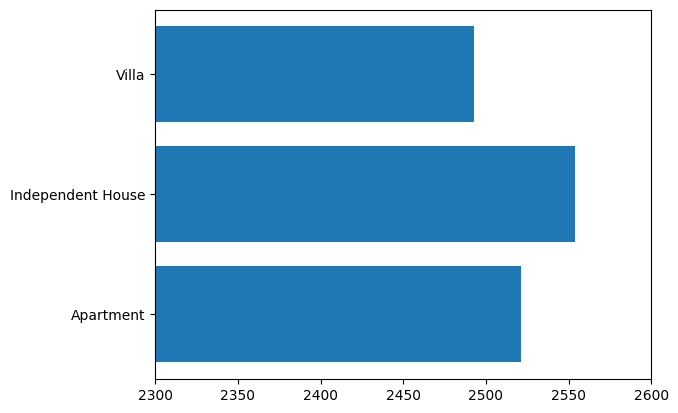
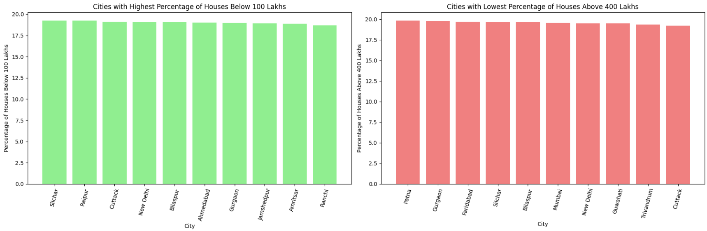

# [SKN09-EDA-4Team]
✅ SKN AI FAMILY CAMP 9기 
✅ 개발 기간: 2025.01.15 - 2025. 01.21

---

# 📍Introduction Team(팀 소개)
### 🏠팀명: Howse 
  부동산(House) 데이터를 어떻게(How?) 분석할 것인가에 대해 연구하는 하우즈입니다.
### 👩‍💻팀원
 
| 김우중👨‍💻 | 임수연👩‍💻 | 조민훈👨‍💻 |
|--|--|--|
|<a href="https://github.com/kwj9942">@kwj9942</a>|<a href="https://github.com/ohback">@ohback</a>|<a href="https://github.com/alche22">@alche22</a>|
 

# 📍프로젝트 개요
### 프로젝트명
주택 특성을 이용한 가격 예측

### 프로젝트 배경
- 배경: 주택보유율이 낮은 이 시대에 사용자의 내 집 마련을 목표로 주택 특성, 주변 인프라, 도시별 평균 집값 차이 등에 따른 주택 가격을 예측하고 합리적인 주택 구매를 위한 시스템을 설계했습니다.
 

출처 : https://news.kbs.co.kr/news/pc/view/view.do?ncd=8139571
 
 

---

# 📍Data Pre-Processing(데이터 전처리)
## ✅EDA 진행 목차
### 1. 데이터 로드 & 확인 
- Kaggle에서 "House Price Prediction" 으로 검색하여 가장 최근에 업데이트 된 데이터를 선정.

 

### 2. 데이터 구조 및 기초 통계 확인
- 12개의 문자형 변수와 11개의 숫자형 변수로 구성되어 있으며 결측치가 존재하지 않는다.

 

- 기본 통계 정보를 확인하였을때 0인 값이 존재

 

- Price_per_SqFt는 제곱피트당 가격으로 0이 나와서는 안되는 값이라 따로 계산해본 결과, 소수점 둘째 자리에서 잘리면 0으로 나오는 것을 확인하였다.

 

- 라벨링을 통한 범주형 데이터 처리

 

### 3. 결측치 및 이상치 탐색
- 데이터 탐색 과정에서 결측치(NaN)가 발견되지 않아 결측치 처리는 생략하였다.
- 이상치(Outlier)를 탐색하기 위하여 모든 변수에 대해 BoxPlot을 그려 보았으며 대부분의 데이터들이 고르게 분포하는 것을 확인할 수 있었다.

 

---

# 📍데이터 시각화를 통한 탐색📊
- HeatMap을 통해 변수별 상관관계를 확인해 보았다.

 

- Regplot을 통해 Target변수와 선형관계를 확인해 보았다.

 

- 연도별 건축된 건물의 유형을 확인해 보았다.

 

---
- 사회간접자본에 따른 평균 집값

- 부대시설에 따른 평균 집값
  

- 시공상태에 따른 평균 집값
  

- 채광방향에 따른 평균 집값
  

- 소유주에 따른 평균 집값
  

---
- 도시/주 별 평균 집값

 

- 도시/주 별 평균 평당 가격

 

- 전체 평균 집값을 기준, 도시별 평균 이상/이하 비율

 

- 집값의 범위를 3구간으로 나누어 출력한 Boxplot과 KDE

 

- 도시별/구간별 집값의 비율

 

- 도시별 100Lakhs 이하 / 400Lakhs 이상 집값의 비율

 

- 도시별 100Lakhs 이하 / 400Lakhs 이상 집값의 비율의 하위 10개 도시

 

---

# 결론📈
처음에는 잘 설계하여 추출한 데이터로 생각하였으나 탐색적 데이터 분석을 한 결과 이 데이터는 시뮬레이션 데이터로 추측된다. 탐색적 데이터 분석 결과 변수 간 관계 및 특성을 파악할 수 없었으며, 몇가지 간단한 모델 학습도 잘 학습이 되지 않는 모습을 보였다. 데이터에 추가적인 처리를 가하는 것으로 성능을 끌어올리는 것이 불가능하다고 판단되어 추후 관련된 다른 데이터를 찾아 다음 단계를 진행할 예정이다.

---

# 한줄회고📌
- 김우중 : 시각화 자료를 너무 안일하게 보고 있었던 것 같다. Heatmap이나 regplot을  보고 데이터를 바꿨어야 했다.
- 임수연 : 데이터셋의 문제로 인사이트 도출을 해내진 못했지만 혹시 모를 숨겨져있는 특성을 찾아내기 위해 기존 변수들을 변환/조합하여 다양한 방식으로 변수를 활용 해볼 수 있는 기회가 되었고 미래엔 한발 더 나가아 추가적인 데이터셋을 가져와 비교하는 등의 방법을 시도해 보 수 있을 것 같습니다.
- 조민훈 : 이번 데이터를 반면교사 삼아 이후의 데이터를 찾을 때는 원산지를 확인하고 데이터 신뢰도 검증을 보다 철저히 해야겠다.
